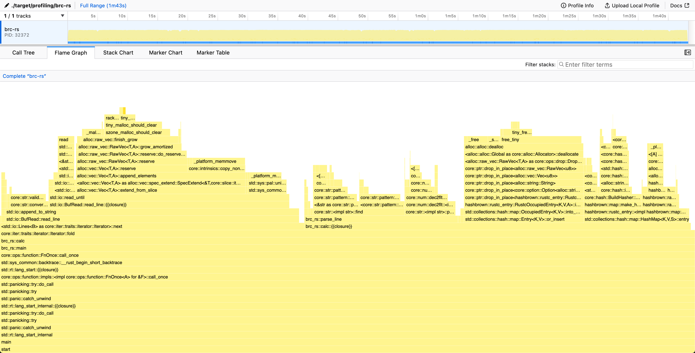
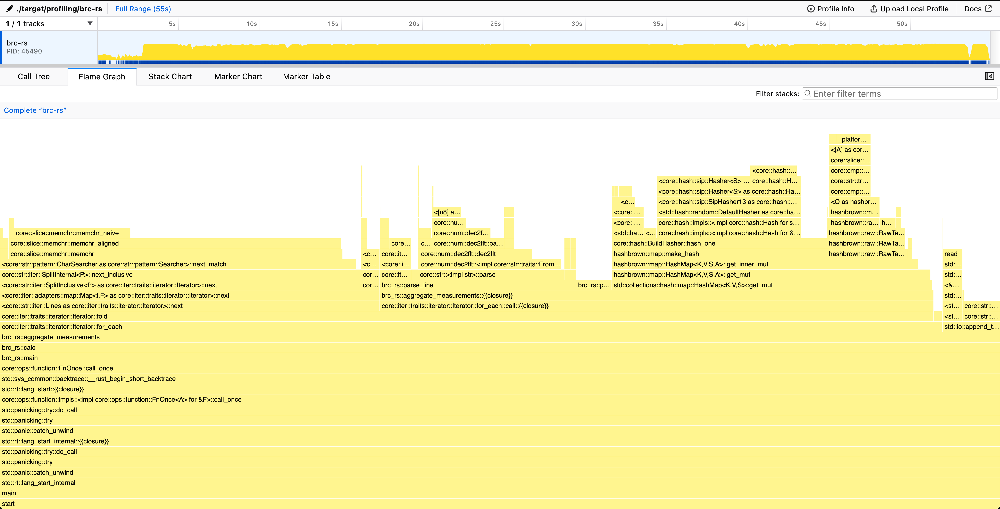
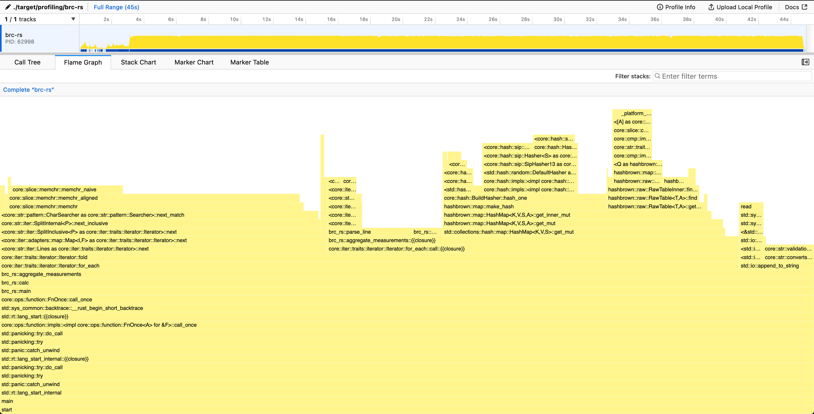
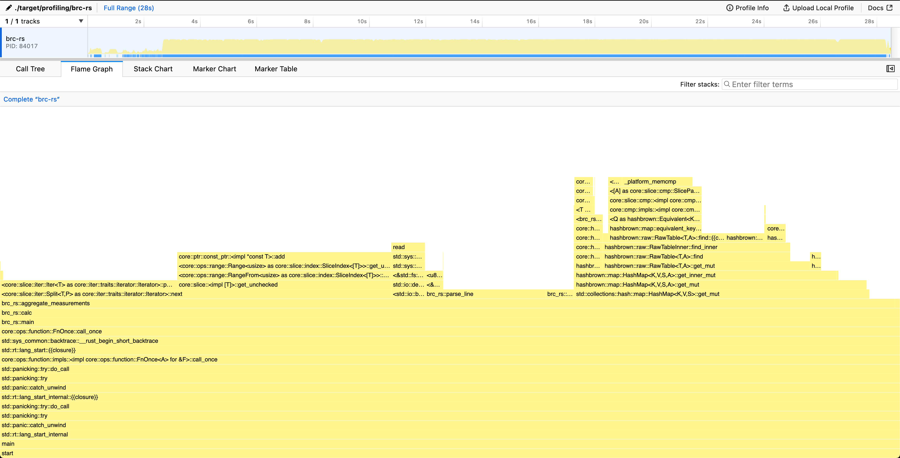
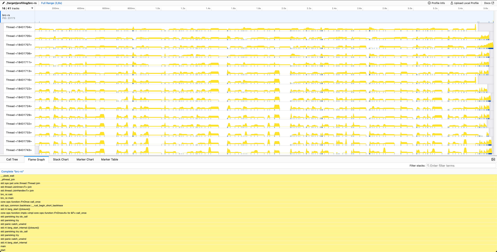

Note (2026-01-13): this post originally resided within the repository README.md, and is now migrated to the blog. The publish date is the original commit for the final version of the README.md

This repository contains my implementation in Rust for the One Billion Row Challenge (1BRC), which tests the limits of processing one billion rows from a text file. [Original challenge repository](https://github.com/gunnarmorling/1brc)

The main idea is to explore optiziming performance of a program through profiling and parallellism, with also trying to use only ["Safe Rust"](https://doc.rust-lang.org/nomicon/meet-safe-and-unsafe.html#meet-safe-and-unsafe). All error handling of this project is handled poorly knowingly, and only the happy path is considered.

## Challenge

The text file contains temperature values for a range of weather stations.
Each row is one measurement in the format `<string: station name>;<double: measurement>`, with the measurement value having exactly one fractional digit.
The following shows ten rows as an example:

```csv
Hamburg;12.0
Bulawayo;8.9
Palembang;38.8
St. John's;15.2
Cracow;12.6
Bridgetown;26.9
Istanbul;6.2
Roseau;34.4
Conakry;31.2
Istanbul;23.0
```

The task is to write a program which reads the file, calculates the min, mean, and max temperature value per weather station, and emits the results on stdout like this
(i.e. sorted alphabetically by station name, and the result values per station in the format `<min>/<mean>/<max>`, rounded to one fractional digit):

```
{Abha=-23.0/18.0/59.2, Abidjan=-16.2/26.0/67.3, Abéché=-10.0/29.4/69.0, Accra=-10.1/26.4/66.4, Addis Ababa=-23.7/16.0/67.0, Adelaide=-27.8/17.3/58.5, ...}
```

## Optimization Results

Here is a table for a quick summary of the current progress of the optimizations.
Benchmarks and profiling results shown below are run against a `measurements.txt` generated with `./create_measurements.sh 1000000000`, having 1 billion entries using a 10-core 14" Macbook M1 Max 32 GB.

| Optimization                                                                                  | Time (mean ± σ):  | Improvement over previous version                         | Summary                                                                                                                  |
| --------------------------------------------------------------------------------------------- | ----------------- | --------------------------------------------------------- | ------------------------------------------------------------------------------------------------------------------------ |
| [Initial Version](#initial-version)                                                           | 149.403 s ± 0.452 | N/A                                                       | Naive single-core implementation with BufReader & HashMap                                                                |
| [Unnecessary string allocation](#unnecessary-string-allocation)                               | 102.907 s ± 1.175 | <strong style="color:#22c55e;"> -46,496 s (-31%)</strong> | Remove an unnecessary allocation of a string inside loop                                                                 |
| [Iterate over string slices instead of String](#iterate-over-string-slices-instead-of-string) | 63.493 s ± 1.368  | <strong style="color:#22c55e;"> -39,414 s (-38%)</strong> | Read the entire file into memory first, iterate over string slices, move away from using Entry API for accessing hashmap |
| [Improving the line parsing #1](#improving-line-parsing)                                      | 55.686 s ± 1.304  | <strong style="color:#22c55e;"> -7,807 s (-12%)</strong>  | Replace `str::find` with a custom, problem-specific separator finder                                                     |
| [Improving the line parsing #2](#writing-a-custom-measurement-parser)                         | 44.967 s ± 0.542  | <strong style="color:#22c55e;"> -10,719 s (-19%)</strong> | Custom, byte based measurement value parser building on top of previous optimization                                     |
| [Use `Vec<u8>` everywhere instead of `String`](#using-vecu8-instead-of-string)                | 38.470 s ± 0.485  | <strong style="color:#22c55e;"> -6,497 s (-14%)</strong>  | Time save mostly from not needing to do UTF-8 validation when using `Vec<u8>`, as that is not necessary.                 |
| [a custom hash function](#using-a-custom-hash-function)                                       | 30.427 s ± 0.455  | <strong style="color:#22c55e;"> -8,043 s (-21%)</strong>  | Use a custom hash function for the hashmap that is used by the Rust Compiler                                             |
| [Custom chunked reader](#chunked-reader-to-reduce-memory-footprint--prepare-for-parallellism) | 29.310 s ± 0.276  | <strong style="color:#22c55e;"> -1,117 s (-4%)</strong>   | Write a custom chunked file reader to prepare for parallellism and reduce memory allocation                              |
| [Tweak chunk size](#tweaking-the-chunk_size)                                                  | 28.663 s ± 0.546  | <strong style="color:#22c55e;"> -0,647 s (-2%)</strong>   | Small tweak for the fixed buffer-size created in previous improvement                                                    |
| [Multithreading](#multithreading)                                                             | 3.747 s ± 0.093   | <strong style="color:#22c55e;"> -24,916 s (-87%)</strong> | Multithread the program to utilize all cores on the system                                                               |

### Initial Version

Nothing special really, just a quick version to get things going with a `HashMap<String,WeatherStationStats`.

Struggled too long with getting a correct implementation of the rounding calculation to pass the original test suite.

Going forward, the rounding conventions will change, with the test files being generated with the initial version of this project with only the conversion logic changed.

```sh
~/src/github/brc-rs (master*) » ./bench.sh
Benchmark 1: ./target/release/brc-rs
  Time (mean ± σ):     149.403 s ±  0.452 s    [User: 144.499 s, System: 2.486 s]
  Range (min … max):   149.037 s … 150.110 s    5 runs
```


Looking at the flame graph, we spend ~30% of the time in `<std::io::Lines as core::iter::traits::iterator::Iterator>::next`. That is, reading the file line by line. This most likely due to the use of [`BufRead::lines()`](https://doc.rust-lang.org/std/io/trait.BufRead.html#method.lines) for iterating the lines, as it creates a new `String` for each row, allocating memory. This allocation of each line separately creates unnecessary overhead, and probably should be looked into first.

Inside the `calc`-function we also spend 13% of the time creating strings and 17% of the time dropping Strings, freeing the allocated memory. We spend 16% in actually parsing the line, and 22% doing hashmap operations.

### Unnecessary string allocation

Even though the profile indicates that looking into the reading of the file should probably be looked into first, during writing the previous analysis I realized that I made a totally unnecessary string allocation inside `calc`.

As we receive a String from the iterator already and it isn't used in any other way than passed as a string slice to `parse_line`
, we can instead pass it to `parse_line` and return the original line string but truncated to only contain the station name.
By doing this, we can use that as the key for the hashmap instead of allocating a new string entirely for it.

```sh
~/src/github/brc-rs (main*) » ./bench.sh
Benchmark 1: ./target/release/brc-rs
  Time (mean ± σ):     102.907 s ±  1.175 s    [User: 98.842 s, System: 2.179 s]
  Range (min … max):   101.440 s … 104.566 s    5 runs
```

This just goes to show that allocating another string unnecessarily with this amount of data has already a significant impact on performance.



### Iterate over string slices instead of String

The reading of the file has grown to 44% time spent. This needs to be addressed.

Let's first investigate the iterator performance with writing some test programs:

```rust
// test-bufread-lines.rs
use std::io::BufRead;
fn main() {
    let now = std::time::Instant::now();
    let f = std::fs::File::open("measurements.txt").unwrap();
    let reader = std::io::BufReader::new(f);
    let mut amount_read = 0;
    for line in reader.lines() {
        amount_read += line.unwrap().len() + 1; // add the newline character back
    }
    println!("reading {amount_read} bytes took {:#?}", now.elapsed());
}
```

This program emulates the current implementations line iteration by using the [`BufRead::lines`](https://doc.rust-lang.org/std/io/trait.BufRead.html#method.lines)-function to iterate over each line.
Note that the lines returned are all of type `String` underneath.

```sh
~/src/github/brc-rs (main*) » rustc -O test-bufread-lines.rs
~/src/github/brc-rs (main*) » hyperfine ./test-bufread-lines
Benchmark 1: ./test-bufread-lines
  Time (mean ± σ):     55.872 s ±  0.080 s    [User: 53.816 s, System: 1.860 s]
  Range (min … max):   55.764 s … 56.055 s    10 runs
```

So 55 seconds for iterating the file line by line? That seems kind of slow. Let's try to see if we can improve on that.

Now let's look at the following program:

```rust
// test-read-to-string-lines.rs
use std::io::Read;
fn main() {
    let now = std::time::Instant::now();
    let f = std::fs::File::open("measurements.txt").unwrap();
    let mut reader = std::io::BufReader::new(f);
    let mut s = String::new();
    reader.read_to_string(&mut s).unwrap();
    let mut amount_read = 0;
    for line in s.lines() {
        amount_read += line.len() + 1; // add the newline character back
    }
    println!("reading {amount_read} bytes took {:#?}", now.elapsed());
}
```

Instead of using `BufRead::lines`, here we first read the entire file into a `String` and then iterate over the lines with `str::lines`.

```sh
~/src/github/brc-rs (main*) » rustc -O test-read-to-string-lines.rs
~/src/github/brc-rs (main*) » hyperfine ./test-read-to-string-lines
Benchmark 1: ./test-read-to-string-lines
  Time (mean ± σ):     19.514 s ±  0.793 s    [User: 15.472 s, System: 1.311 s]
  Range (min … max):   18.939 s … 21.331 s    10 runs
```

Reading the entire string first into memory results in a staggering 66% performance improvement.
The penalty coming from the `BufRead::lines`-iterator is that it allocates every line separately as a `String`.
This means on each line iteration, we allocate (and also de-allocate) memory, which causes significant overhead.
However, reading the entire file into a single String comes with a glaring drawback: the entire file will be stored in memory at once, so the memory footprint will be affected.

```sh
~/src/github/brc-rs (main*) » /usr/bin/time -l ./test-bufread-lines
reading 13795898567 bytes took 56.876117291s
         --- redacted ---
         1114688  peak memory footprint
```

Peak memory footprint of ~1.1 MB when using the buffered reader.

```sh
~/src/github/brc-rs (main*) » /usr/bin/time -l ./test-read-to-string-lines
reading 13795898567 bytes took 21.289027s
          --- redacted ---
         13803464960  peak memory footprint
```

The peak memory footprint is now on the neighbourhood of 13.8GB, so a roughly 10,000x increase over using the buffered reader.
This isn't ideal and not the final solution I'd hope to achieve, but for now it's good enough (and allowed in the original rules, so 🤷).
Further improvements will be done later on, but for that we need to look at other parts to refactor until we can get back to this.

Now that we iterate over string slices instead of strings, we need to revert our `parse_line` to its previous state.
Another problem arises with the [`HashMap::entry()`](https://doc.rust-lang.org/std/collections/hash_map/struct.HashMap.html#method.entry) access method into the hashmap.
The function requires passing the key by value instead of reference, meaning we would need to allocate a new string for the station name on each iteration.
This would result as going back to allocating on each iteration, removing the optimization.
[The Entry API in the standard library doesn't seem to work with expensive keys](https://stackoverflow.com/questions/51542024/how-do-i-use-the-entry-api-with-an-expensive-key-that-is-only-constructed-if-the/56921965#56921965)

Let's instead use [`HashMap::get_mut()`](https://doc.rust-lang.org/std/collections/hash_map/struct.HashMap.html#method.get_mut) with a `match`, either modifying the value or inserting a new one.
Here we limit the allocations to only occur on the inserts, and `get_mut()` happily takes a string slice as argument.

```sh
~/src/github/brc-rs (main*) » ./bench.sh
Benchmark 1: ./target/release/brc-rs
  Time (mean ± σ):     63.493 s ±  1.368 s    [User: 58.224 s, System: 2.112 s]
  Range (min … max):   62.183 s … 65.675 s    5 runs
```


The line reading still uses quite a significant portion of the time (27% line iteration + 9% for loading the string into memory). However, it is not the biggest consumer of time anymore, which indicates we need to change our focus.
We spend 39% of time inside `parse_line()` and need to do some improvements on that next.
The `HashMap::get_mut()` is also starting to creep up in the chart with 23% of time spent.

### Improving line parsing

Now that we have gotten rid of most of the "free" improvements out of the way, we can start looking at actually improving the performance of the parsing logic of the lines.
This section is divided in two parts; finding the data separator followed by improving the parsing logic.

#### Replacing `str::find` with a custom separator finder

Biggest share of time inside `parse_line()` is spent in [`str::find`](https://doc.rust-lang.org/std/primitive.str.html#method.find).
This is used for separating the station name from the measurement data point.
Using a generic "find from string"-function is fine for initial implementation and good for readability, but performance is being left on the table if we don't utilise all the knowledge we have.

Reading the [challenge rules](https://github.com/gunnarmorling/1brc?tab=readme-ov-file#rules-and-limits), we know that the station name is a valid UTF-8 string with length varying between 1 and 100 bytes. The maximum length of the measurement data point is at most 5 characters ("-99.9") and is always pure ASCII.

As the average length of a measurement is much smaller than the UTF-8 string, we can change our approach to start reading the line from the end.
Also as the measurement is known to be pure ASCII, we can iterate over the bytes directly instead of the characters.

This makes finding the separator use at most six byte comparison operations. We could further reduce this down to three, as there is always guaranteed to be 1 fractional digit, a period, and a whole number, but this is improvement is quite insignificant and we'd need to remove it anyway for the next part.

```sh
~/src/github/brc-rs (main*) » ./bench.sh
Benchmark 1: ./target/release/brc-rs
Time (mean ± σ): 55.686 s ± 1.304 s [User: 50.524 s, System: 2.026 s]
Range (min … max): 54.354 s … 57.095 s 5 runs
```



From the graph we see that `parse_line()` has shrunk significantly, with now the floating point value parsing taking majority of the time.

#### Writing a custom measurement parser

At this point we probably already start looking into replacing the standard hashmap with something custom or looking into the line parsing again, but we're not done yet with improving the `parse_line()`-function yet.
Now we'll look at how we can improve parsing the value from the standard [`f64::FromStr`](https://doc.rust-lang.org/std/primitive.f64.html#method.from_str) to something custom based on the information given to us.

Quick recap regarding the specification in the rules regarding the measurement data:

> Temperature value: non null double between -99.9 (inclusive) and 99.9 (inclusive), always with one fractional digit

Based on this information, we always know that there is only a single fractional digit and at most two digits for the whole number part.
What first comes to mind is to convert the number into a whole number entirely by shifting/removing the decimal point from the number, and converting back to decimal in the end.
This would allow us to do all the math with 64-bit integers instead of floating point numbers, that seems to be faster on M1 silicon at least according to this [Stack Overflow post](https://stackoverflow.com/questions/2550281/floating-point-vs-integer-calculations-on-modern-hardware). More notably, writing a custom parser for an integer is far more trivial over doing the same for a float.

However, we are immediately met with an issue: we have a string slice, how should we go around of creating the integer? [`str::replace`](https://doc.rust-lang.org/std/primitive.str.html#method.replace) the '.' and [`i64::FromStr`](https://doc.rust-lang.org/std/primitive.isize.html#impl-FromStr-for-isize)? That would decimate our performance, as `str::replace` returns a String, i.e. allocates memory, which we already have determined to be really slow in previous sections. Also at least for the moment, swapping places with the fractional digit and the '.' is not possible either, as that would require for us to have a `&mut str`, which isn't provided by the line iterator.

There was a slight hint in the previous section of the answer for this problem. When we reverse iterate the bytes to find the semicolon separating the station name and the measurement, we also go through all of the bytes of the measurement itself. We can then parse these bytes accordingly, converting the ASCII-number characters into numbers one by one, multiplying by 10 and 100 for the whole numbers to shift them in base ten. Conversion from ASCII to a decimal number works so that we remove 48 (or `b'0'` with Rust syntax), from each byte-value, as the numbers from 0 to 9 are in order in ASCII, starting from 48 for '0'.

```sh
~/src/github/brc-rs (main*) » ./bench.sh
Benchmark 1: ./target/release/brc-rs
  Time (mean ± σ):     44.967 s ±  0.542 s    [User: 39.777 s, System: 1.882 s]
  Range (min … max):   44.196 s … 45.416 s    5 runs
```


After these improvements, we have reduced our time spent in `parse_line()` from 39% to 14%.
Quite happy with that, and time to look at other places for improvements, namely either the line-iterator or the hashmap operations.

### Using `Vec<u8>` instead of `String`

Now that our `parse_line()` function is totally custom, and both user bytes directly, there is no need for us to use strings anymore.
On the right corner of the previous flamegraph, we can see that we spend around 5% of the program in something called `core::str::validations:run_utf8_validation`.
This is UTF-8 string validation, as all `String`-types must be valid UTF-8 in Rust it runs always when not using `unsafe`.

As none of our code beneath relies on having string slices anymore, we can get an easy win here by converting all Strings and string slices used in `aggregate_measurements()` to use `Vec<u8>` and byte slices respectively.
Our hashmap also changes its signature to `HashMap<Vec<u8>,WeatherStationStats>`, and some string conversion is required in the result string calculation, but those take insignificant time over the hot path.

```sh
~/src/github/brc-rs (main\*) » ./bench.sh
Benchmark 1: ./target/release/brc-rs
Time (mean ± σ): 38.470 s ± 0.485 s [User: 33.038 s, System: 2.247 s]
Range (min … max): 37.837 s … 38.919 s 5 runs
```


The line iterator is still taking up 40% of all the time spent in the program, but optimization beyond this point seems quite difficult, and easier gains can be found elsewhere.
Replacing the standard hashmap implementation seems like the logical step forward.

### A custom hash function

Currently, 23% of all time spent is in `hashbrown::map::make_hash`. This is the conversion of a hashable type (in this case `&[u8]`) to a 64-byte hash enclosed in a `u64`.
This value can then be used to find the value from the underlying data structure, that is hidden from the end-user of a hashmap. Regardless, this is quite slow and can be improved.

Hashmaps in Rust need to be provided a struct implementing the trait [`BuildHasher`](https://doc.rust-lang.org/std/hash/trait.BuildHasher.html).
As one of would guess its task is to build [`Hashers`](https://doc.rust-lang.org/std/hash/trait.Hasher.html).
One is built each time a new hash needs to be calculated.
Hashers built by the same instance of a builder must always result in same output with the same input.

The default `BuildHasher` that is the default for `HashMap` is [`RandomState`](https://doc.rust-lang.org/std/collections/hash_map/struct.RandomState.html).
For each `RandomState`, a new randomized pair of keys is built that it then passes to it's hashers during construction.
These randomized keys are there to prevent [Hash DoS attacks](https://en.wikipedia.org/wiki/Collision_attack) from malicious users.

Given that our input is not malicious, we don't seem to benefit from the randomized seeding of the `HashMap`, so we can instead look for better performance instead.
After looking around into alternatives, I found [`rustc_hash`](https://docs.rs/rustc-hash/latest/rustc_hash/) with quite a quite nice [`Hasher`-implementation](https://docs.rs/rustc-hash/latest/src/rustc_hash/lib.rs.html#76-109).
Originally based on Firefox's hashing algorithm, this crate is used in `rustc` due to it's perforamnce over standard library.
The characteristics of a compiler make it unsusceptible to Hash DoS-attacks.

I took the `Hasher` implementation from that crate and integrated it only with `u64` instead of the original `usize`.
This might technically break the rules a bit, but there are still no dependencies in the project (apart from `rand` and `rand_distr` for the measurements generation binary).

```sh
~/src/github/brc-rs (main*) » ./bench.sh
Benchmark 1: ./target/release/brc-rs
  Time (mean ± σ):     30.427 s ±  0.455 s    [User: 25.203 s, System: 1.876 s]
  Range (min … max):   29.945 s … 31.111 s    5 runs
```



### Chunked reader to reduce memory footprint & prepare for parallellism

In section [Iterate over string slices instead of String](#iterate-over-string-slices-instead-of-string), we moved from reading the file line by line to loading the entire file first into memory instead.
This caused our memory usage to increase to a staggering 13GB, but gained us some performance in not having to allocate and deallocate smaller strings constantly.

However, as mentioned in the section, this was not the optimal/end result we wanted to achieve, and now it's time to go back to that.
Allocating 13GB and reading the entire file is still inefficient, as we are blocked from doing anything for the whole duration when loading the file into memory.
Looking the previous flame graph, this loading the file seems to be taking around 2-3 seconds. Ideally, we'd like to have the I/O distributed evenly along the program.

Where this matters more is when we want to start utilizing multiple cores at once.
With our current approach, when we spawn threads we'd start reading from the file system concurrently with each thread.
This would then be putting more stress on the I/O, Thus blocking all the threads.

To prevent the 13GB allocation and prepare for parallellism, it's time to ditch [`BufReader`](https://doc.rust-lang.org/std/io/struct.BufReader.html) and write our own buffered reader.
The concept is exactly the same as what `BufReader` does under the hood, but with us having full control of the underlying buffer and reading from the file.
We'll create a fixed-size slice of bytes to act as our "buffer" where we'll read bytes into directly from the file handle (or anything that implements [`Read`](https://doc.rust-lang.org/std/io/trait.Read.html)-trait.)

The complexity in this approach is handling the case when we hit the end of the currently read buffer.
As we read a fixed amount in bytes at once, there is no guarantee that we read full lines.
The last characters in the end of our buffer are most likely a start of a new line, but not a complete one.

What we need to do to address is the following:

1. Fill the buffer in its entirety
2. Parse the lines, keeping track of how many bytes we have read from the buffer.
3. Do this until we hit the point where we do not find a newline-character
4. Copy the remainining characters from the end to the start of the buffer.
5. Read from the file to the buffer, but this time starting after the remaining characters we just copied.
6. Repeat until we reach `EOF`. After that exit the loop.

When we reach `EOF`, the [`Read::read`](https://doc.rust-lang.org/std/io/trait.Read.html#tymethod.read) returns `Ok(0)`, indicating that no new bytes were read. Combining with the fact that we only try reading more when we don't have a complete line in the remaining characters, we know that there are no more lines to be parsed, and we can exit the loop.

```sh
~/src/github/brc-rs (main*) » ./bench.sh
Benchmark 1: ./target/release/brc-rs
  Time (mean ± σ):     29.310 s ±  0.276 s    [User: 27.071 s, System: 1.465 s]
  Range (min … max):   29.036 s … 29.696 s    5 runs
```

As expected, not that big of an improvement for the single-core result, only potential we save is that we don't need to allocate 13GB of contiguous memory.

```sh
~/src/github/brc-rs (main*) » /usr/bin/time -l target/release/brc-rs
                ...
29.40 real        27.21 user         1.52 sys
      1261568  maximum resident set size
                ...
      967232  peak memory footprint
```

As we can see, our `peak memory footprint` is again under 1MB.


Now looking at the graph, the ~2-3s I/O blocking for the CPU usage has vanished from the chart.
As we do the same amount of blocking I/O than previously, this just means the blocking is distributed more evenly through the whole execution time.

#### Tweaking the `CHUNK_SIZE`

In the first chunked reader implementation, an arbitrary chunk-size of 50 000 bytes was chosen.
This can be thought of as a byte-interval, after we start reading the file again.
With too small of a chunk-size, we start paying for the I/O overhead unnecessarily.
After some testing, it seems that that 500 000 bytes (0,5 MB) seems to be a better balance between I/O overhead and memory usage on an M1 Mac.

```sh
~/src/github/brc-rs (254edb8) » ./bench.sh
Benchmark 1: ./target/release/brc-rs
  Time (mean ± σ):     28.663 s ±  0.546 s    [User: 26.501 s, System: 1.259 s]
  Range (min … max):   28.304 s … 29.631 s    5 runs
```

### Multithreading

We have now prepared our program to be able to handle multiple threads at once, and we can start utilizing them to speed up the program.

One might wonder why this wasn't done earlier, but profiling and optimizing a single-threaded program is much more straightforward than a multithreaded one.
As long as we keep the fact that we are going to use multiple threads in mind, we can optimize the single-threaded program to be as fast as possible, and then just spawn more threads to do the same work.

We need to somehow divide the work we have done sequentially into multiple threads.
This can be achieved by dividing the file into chunks and then processing each chunk in a separate thread.

However, we need to be careful when creating the chunks, as we need to make sure that we don't split the lines in the middle.
To do this, we can "peek into" the file at `chunk_size`, and then read forwards until we find a newline character.
Then set the next chunk to start after that newline character.

After creating the chunks, we can then spawn a thread for each chunk, and have them process the chunk in parallel.

After a thread is finished, it will insert its results into the shared hashmap, locked by a [`Mutex`](https://doc.rust-lang.org/std/sync/struct.Mutex.html).
As we are using a `Mutex`, only one thread can access the hashmap at a time, blocking other threads from accessing it until the lock is released.
This time isn't a problem, as the amount of time spend holding the lock is minimal compared to the time spent processing the data.

```sh
~/src/github/brc-rs (main*) » ./bench.sh
Benchmark 1: ./target/release/brc-rs
  Time (mean ± σ):      3.747 s ±  0.093 s    [User: 29.739 s, System: 2.102 s]
  Range (min … max):    3.679 s …  3.910 s    5 runs
```


As we can see from the flamegraph, the main thread is mostly waiting for the other threads to finish their work.
Other threads are then doing the actual work of reading the file and processing the data.

Looking at the threads doing the processing, we can see that there are sections where some of the threads have 0% CPU usage.
This is due to I/O blocking, as the thread is waiting for the file to be read into memory.

A slight trick to improve the I/O blocking nature was to create more chunks than there are threads available.
This allows the OS scheduler to switch between threads, potentially enabling I/O blocked threads to be swapped to threads where I/O is not blocked.

## Conclusion

The final(?) result is a program that can process 1 billion rows in 3.7 seconds on a 10-core M1 Macbook Pro.
This is a 97% improvement over the initial version.

A big chunk of the improvement came from multithreading in the end, but without the single-core optimizations done first, we couldn't have been able to parallelize the program as effectively.
Keeping the program single-threaded first allowed us to iterate on the program more easily.

The program is now utilizing all cores on the system, and the I/O blocking is distributed more evenly throughout the program.
The memory footprint is kept low, and the program is quite optimized.

More optimizations could be done, for instance making line parsing branchless, using memory-mapped files, but the latter would require use of `unsafe`-code or external crates, which were not in scope for this project.
For now, I'm quite happy with the results, and I'll leave it at that (for now?)
